::: titlepage
[MIT World Peace University]{.smallcaps}\

Digital Forensics and Investigation\
Third Year B. Tech, Semester 5

------------------------------------------------------------------------

------------------------------------------------------------------------

[Analysing Simlulated Household Router Logs]{.smallcaps} \

------------------------------------------------------------------------

------------------------------------------------------------------------

[Lab Assignment 2]{.smallcaps}

Prepared By

Krishnaraj Thadesar\
Cyber Security and Forensics\
Batch A1, PA 20

2023-08-30
:::

# Aim

To simulate different types of attacks on a router, or a home network.

# Objectives

1.  Simulating different types of attacks on a router, or a home
    network.

2.  To learn about the different types of attacks that can be performed
    on a router, or a home network.

3.  To analyze the Router logs, and make inferences about the attacks.

# Theory

## Router

::: dfn
**Definition 1**. ***Router** is a networking device that operates at
the network layer of the OSI model. It functions as a gateway, directing
data packets between different computer networks. Routers use routing
tables to determine the optimal path for forwarding packets,
facilitating efficient communication between devices.*
:::

::: dfn
**Definition 2**. ***Logs** in the context of networking refer to
records generated by various network devices, including routers, to
capture significant events and activities. Router logs provide a
chronological record of network operations, errors, warnings, and
security-related events. These logs play a crucial role in network
management, troubleshooting, and security analysis. They offer insights
into network behavior, potential vulnerabilities, and unauthorized
access attempts.*
:::

## Router Logs

We were unable to obtain the logs from our router, so we had to simluate
the attacks on our own using a python script, which is given below. The
logs were then generated using the script and then analysed.

For our reference, though, we have included a sample log file from a
router, which is given below.

``` {.bash language="bash" caption="Sample Router Log File"}
1. [2023-08-15 10:12:34] INFO: Router successfully initialized.
    2. [2023-08-15 11:45:21] WARNING: High network traffic detected from IP 192.168.1.15.
    3. [2023-08-15 12:30:05] ERROR: Failed to establish connection with DNS server 8.8.8.8.
    4. [2023-08-16 08:20:10] INFO: New device connected with MAC address 00:1A:2B:3C:4D:5E.
    5. [2023-08-16 09:10:55] INFO: Firmware update successfully applied.
    6. [2023-08-16 09:30:40] ERROR: Unsuccessful login attempt from IP 192.168.1.25.
    7. [2023-08-17 14:05:12] WARNING: DHCP pool depletion. Only 5 IP addresses left.
    8. [2023-08-17 15:20:30] INFO: VPN tunnel established with remote gateway 203.0.113.50.
    9. [2023-08-18 08:45:02] ERROR: Port forwarding request for port 22 already exists.
    10. [2023-08-18 09:55:18] INFO: Quality of Service (QoS) rules updated for improved VoIP performance.
    11. [2023-08-18 12:15:45] WARNING: Suspicious ARP activity detected from IP 192.168.1.10.
    12. [2023-08-19 07:30:22] ERROR: NAT configuration conflict detected in rule set.
    13. [2023-08-19 10:40:17] INFO: Guest network "GuestWiFi" established with password authentication.
    14. [2023-08-19 14:05:30] INFO: Router temperature exceeds safe threshold. Cooling initiated.
    15. [2023-08-20 09:20:05] INFO: Port 80 forwarded to internal server at IP 192.168.1.50.
    16. [2023-08-20 11:10:48] WARNING: Ping sweep detected from external IP 123.456.789.10.
    17. [2023-08-21 13:25:15] ERROR: DNS cache corruption. Flushing cache for resolution.
    18. [2023-08-21 14:50:29] INFO: Network time synchronization successful with NTP server.
    19. [2023-08-22 10:15:02] INFO: Wireless channel changed to optimize signal quality.
    20. [2023-08-22 12:40:18] WARNING: MAC address spoofing attempt from device with MAC 11:22:33:44:55:66.
```

We have instead chosen to directly make a table with the relevant
information. The table and its description is given in the code further
below.

## Attacks Simulated

The following attack scenarios were simulated by my script.

1.  DOS Attack: A Denial of Service (DOS) Attack is a malicious attempt
    to disrupt the normal functioning of a network, service, or website
    by overwhelming it with a flood of traffic. This attack aims to
    exhaust the target's resources, causing it to become unavailable to
    legitimate users. DOS attacks can be achieved through various means,
    such as sending a high volume of requests, exploiting
    vulnerabilities, or using botnets.

    On the router logs, we may see a high volume of requests from a
    single IP address, or a high volume of requests to a single IP
    address. This is what we are looking for.

2.  Brute Force Attack to access Instagram: A brute force attack is a
    trial-and-error method used to obtain information such as a user
    password or personal identification number (PIN). In a brute force
    attack, automated software is used to generate a large number of
    consecutive guesses as to the value of the desired data. Brute force
    attacks may be used by criminals to crack encrypted data, or by
    security analysts to test an organization's network security.\
    On the router it appears as a failed login attempt, and if the
    attack is successful, it will appear as a **successful** login attempt,
    followed by multiple requests to the Instagram server. This is
    because the attacker will try to access the account and then try to
    change the password, which will require multiple requests to the
    server. He may then try and misuse the account amounting to multiple
    requests to the server. This is what we are looking for.

3.  Port Scanning for Surveillance: Port scanning is a method used to
    determine which ports on a network are open and which are closed. It
    is used by hackers to identify vulnerable services listening on a
    port that can be exploited for malicious purposes. Port scanning is
    also used by security analysts to discover vulnerable services and
    applications that can be exploited.

    On the router logs, we may a large number of requests to different
    ports from a single IP address. This is what we are looking for.

# Analysis

## Normal Usage Data

### Interface Usage - Normal Usage

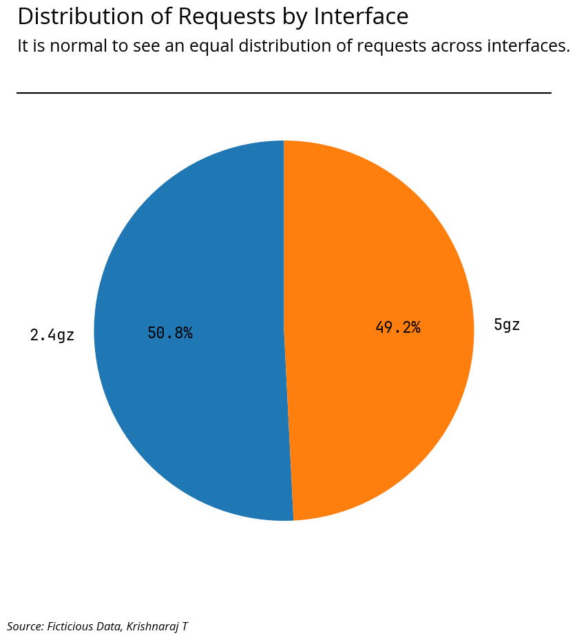

## DOS Attack Data

### Devices Connected - Normal Usage

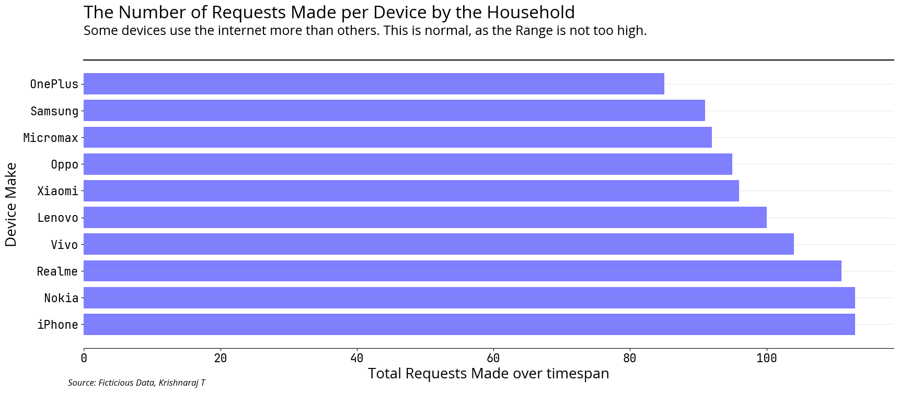

### IP Addresses Connected - DOS Attack

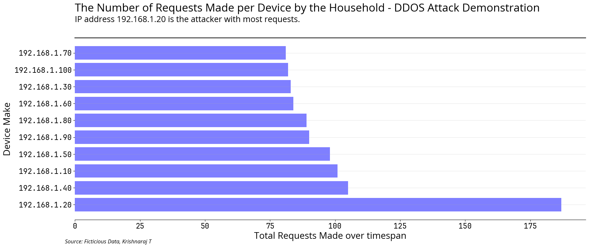

### Hourly Usage - Normal Usage

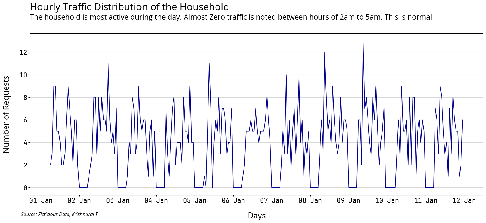

### Hourly Usage - Normal Usage

!

### Protocols Used - Normal Usage

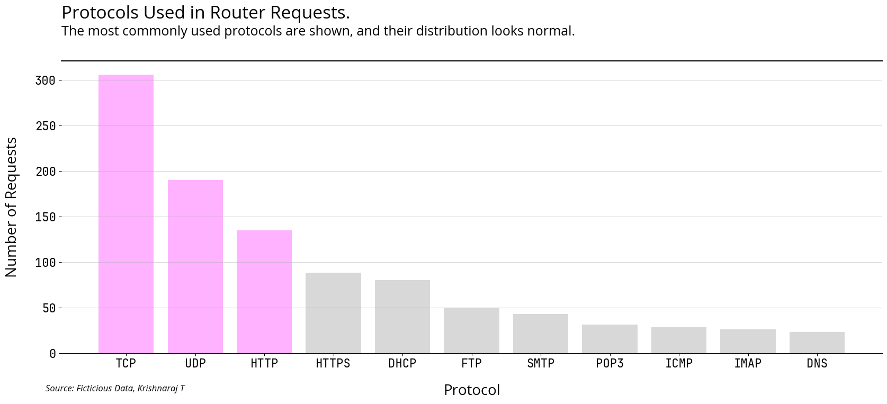

### Protocol Usage - DOS Attack

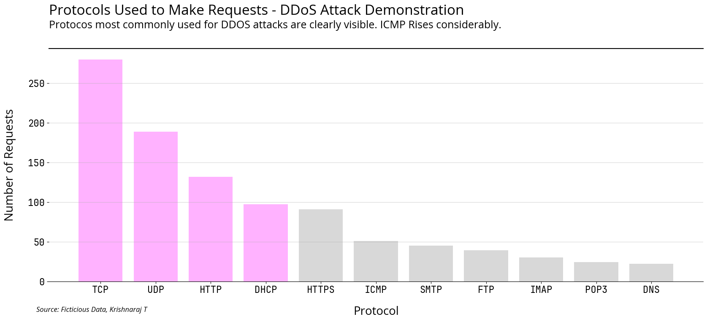

### Daily Usage - Normal Usage

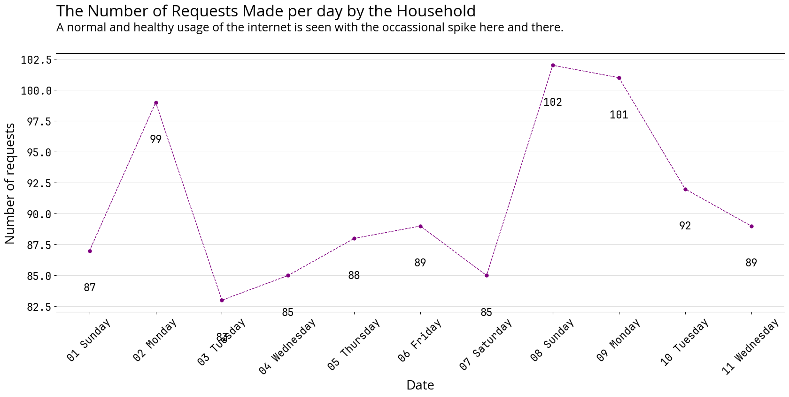

### Daily Usage - DOS Attack

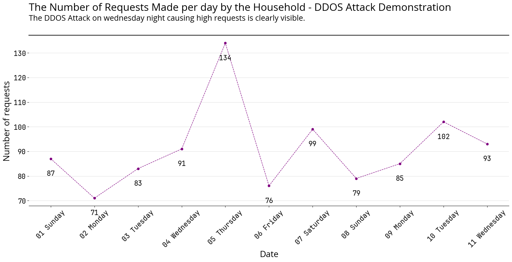

## Brute Force Attack Data

### Hourly Usage - Normal Usage


### Hourly Usage - Brute Force Attack

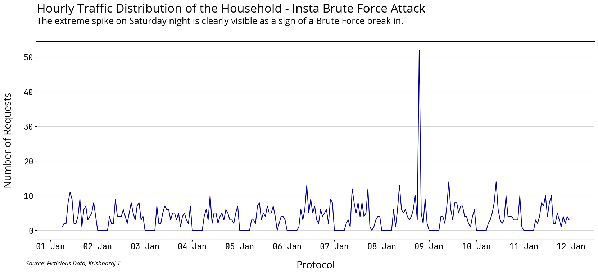

### Daily Usage - Normal Usage


### Daily Usage - Brute Force Attack

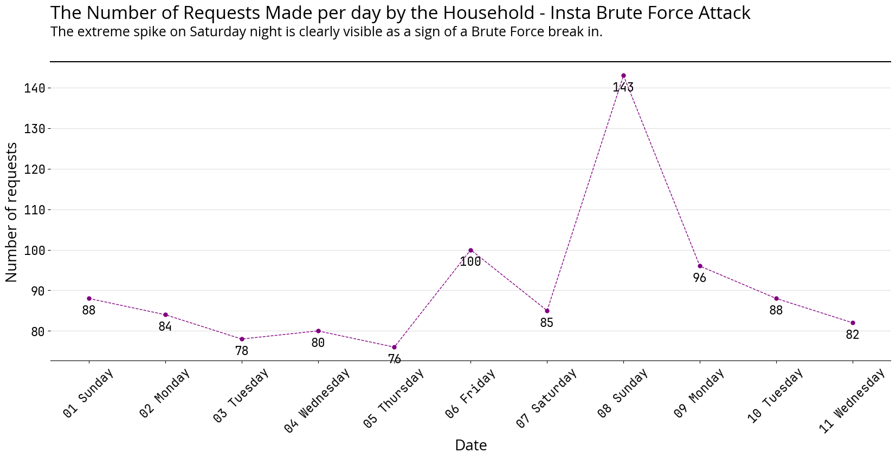

### Websites Visited - Normal Usage

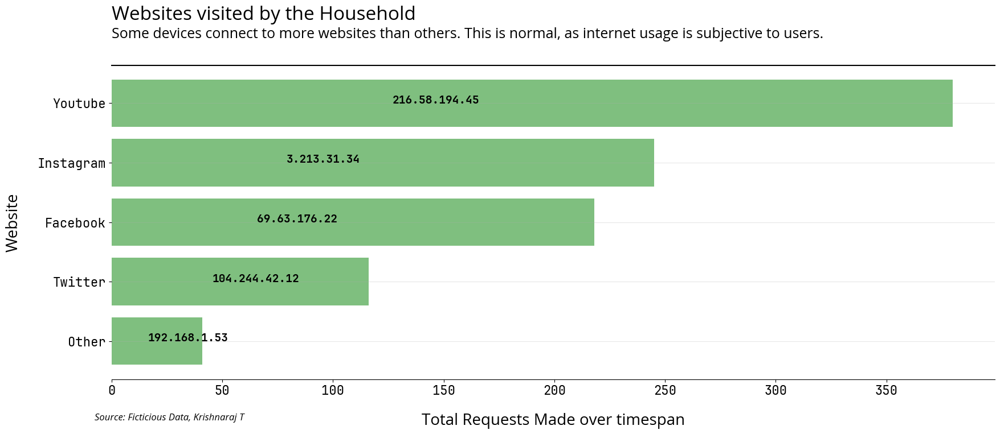

### Websites Visited - Brute Force Attack

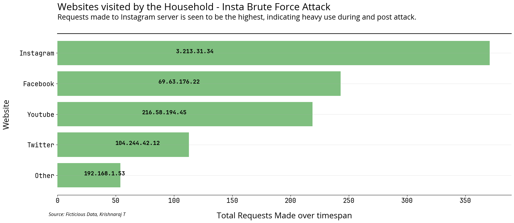

## Port Scanning Data

### Ports Used - Normal Usage

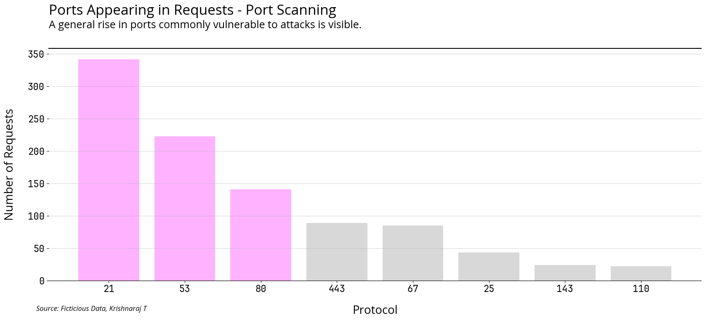

### Port Usage - Port Scanning Attack

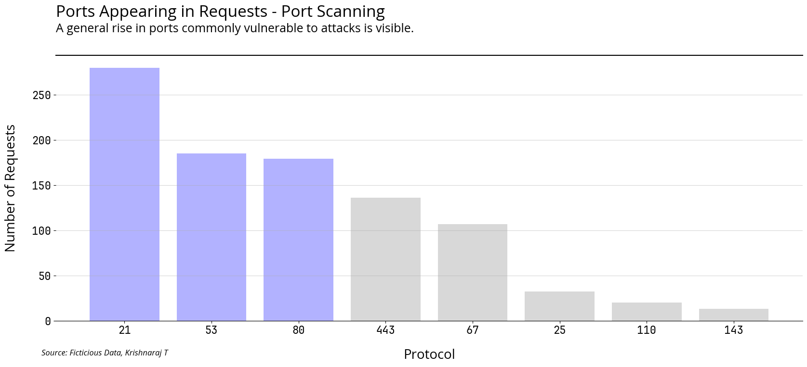

### Daily Usage - Normal Usage


### Daily Usage - Port Scanning Attack

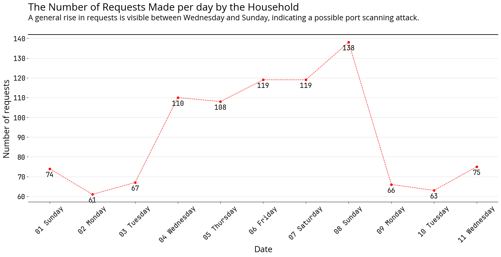

# Platform

**Operating System**: Arch Linux x86-64\
**IDEs or Text Editors Used**: Visual Studio Code\
**Compilers or Interpreters**: Python 3.11\

# Code

## Simulating various Attacks on a Household router network.

We will first import necessary libraries

::: {#strategy}
## Strategy
:::

1.  We will try and simluate a few attacks on a router, and check
    whether those attacks can be detected in hindsight.

2.  To do that we will start with generating some demo data for a
    router, inspired by my home router. This will be a monitor of active
    DHCP Clients.

3.  We will then try and analyse the data to find out anomalies in
    normal usage.

# Generating *normal* demo data

# Let us now simulate some attacks

::: {#dos-attack}
## DOS Attack
:::

::: {#hourly-traffic-distribution-of-the-household---ddos-attack-demo}
## Hourly Traffic Distribution of the Household - DDoS Attack Demo
:::

::: {#instagram-account-brute-force-attack}
## Instagram Account Brute Force Attack
:::

::: {#port-scanning}
## Port Scanning
:::

This is a surveillance technique that is used to identify open ports on
a system. This is used by hackers to identify vulnerable ports on a
system.

# Conclusion

Thus, we have successfully simulated the attacks and analysed the logs
generated by the router. We have also learnt how to analyse the logs and
what to look for in the logs.

::: thebibliography
*Digital Evidence and Computer Crime: Forensic Science, Computers, and
the Internet.*\
Academic Press. [Vskills - Digital Forensic
!Tools](https://www.vskills.in/certification/tutorial/digital-forensics-tools/)
:::
