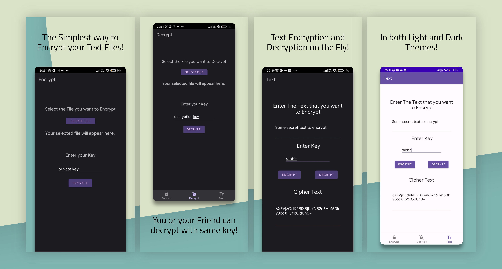

# FileSealer

An app for Encrypting and Decrypting your text files, as well as spontaneous text, with AES-256 encryption.

Its a rpretty simple app as visible here. Made with Android Studio.

# Screenshots

# Installation

Download the App from the releases section in this repository.

# Credits

BouncyCastle: https://www.bouncycastle.org/ for providing the AES-256 encryption library.
